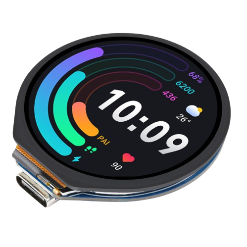
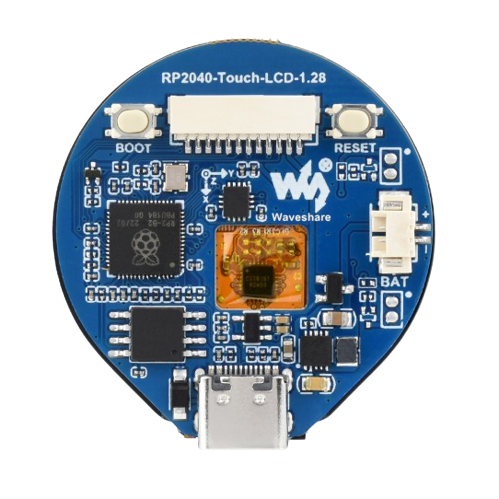

Free Watch Hardware
===================

This repository contains hardware created for Free Watch project based on Waveshare's RP2040 Microcontroller Development Board which has following features:
- [X] rpi2040 microcontroller
- [X] 32.5mm 240x240 round **touch** LCD screen 
- [X] Lithium battery charger
- [X] QMI8658 6-axis IMU
- [X] type-C connector for charging and programming

For a demanding user it lacks a few features, such as:
- [ ] pulsoximeter
- [ ] GPS module
- [ ] side buttons
- [ ] SD card 
- [ ] RTC for powered when rpi is off 
- [ ] magnetometer/compass
- [ ] bluetooth/wifi module (?)

which is a list of features a second board aims to implement.

Since this is a open-source project it will be created in Ki-Cad. 

Reasoning and elements are presented in [a relative link](PARTS.md)